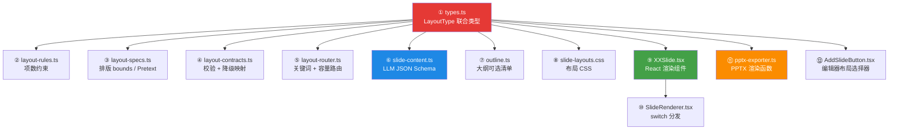

# AIPPT 单页布局模板系统分析 — 新增布局完整指南

> 当前模板库共 **32 种布局**，分布在 6 个大类中。

---

## 一、添加新布局需要更改的文件（12 个接入点）



---

### 层级一：类型定义层

#### ① [types.ts](file:///w:/3spring/AIPPT/src/lib/types.ts) — LayoutType 联合类型

```diff
 export type LayoutType =
   | 'cover' | 'section-header' | 'ending'
   | ...existing layouts...
+  | 'new-layout-name'
```

> 这是所有系统识别新布局的**源头**，改完后 TypeScript 会在所有未处理的 switch/case 处报错，可以当作 checklist 追踪遗漏。

---

### 层级二：AI 生成层

#### ② [layout-rules.ts](file:///w:/3spring/AIPPT/src/lib/layout-rules.ts) — 项数约束

```typescript
// layoutItemRules: 定义布局的 min/max 子项数
// getItemCountConstraintLines(): 生成注入 LLM prompt 的约束说明
// getSplitLimitForLayout(): 内容溢出拆分时的上限值
```

需要添加到 `layoutItemRules` 和两个函数中。

#### ③ [layout-specs.ts](file:///w:/3spring/AIPPT/src/lib/layout-specs.ts) — 排版测量 bounds

```typescript
// layoutSpecs: CSS 尺寸→PPTX 英寸映射（导出用）
// templateBounds: 1920×1080 像素下的文本容器尺寸（Pretext 排版用）
```

必须在 `templateBounds` 中添加条目，定义 title/body/cardHeading/cardBody 等的像素尺寸和默认字号级别。

#### ④ [layout-contracts.ts](file:///w:/3spring/AIPPT/src/lib/ai/layout-contracts.ts) — 内容校验与降级

```typescript
// CARD_LAYOUTS[]: 使用 cards 字段的布局列表
// validateAndNormalizeSlideShape(): LLM 输出校验
// chooseLayoutForNormalizedContent(): 内容不符时自动降级选布局
```

需要：将新布局加入对应的布局列表、添加校验规则、添加降级逻辑。

#### ⑤ [layout-router.ts](file:///w:/3spring/AIPPT/src/lib/ai/layout-router.ts) — 语义路由

在关键词匹配和容量评分系统中注册新布局，使 AI 大纲阶段能自动选到该布局。

#### ⑥ [slide-content.ts](file:///w:/3spring/AIPPT/src/lib/ai/prompts/slide-content.ts) — LLM JSON Schema

```typescript
const layoutSchemas: Record<string, string> = {
  ...
+ 'new-layout': `{
+   "layout": "new-layout",
+   "title": "...",
+   ...JSON schema 示例...
+ }`
}
```

这是 LLM 生成内容时的**格式模板**，直接决定生成质量。

#### ⑦ [outline.ts](file:///w:/3spring/AIPPT/src/lib/ai/prompts/outline.ts) — 大纲可选清单

```typescript
// [可用布局清单 - 32 种模板] 中添加新布局名称和说明
// 用户 prompt / buildCapacityHint() 中的代表性布局列表
```

---

### 层级三：前端渲染层

#### ⑧ [slide-layouts.css](file:///w:/3spring/AIPPT/src/styles/slide-layouts.css) — 布局 CSS

定义新布局的 HTML/CSS 结构（网格/flex/padding/gap 等）。

#### ⑨ `layouts/NewLayoutSlide.tsx` — React 渲染组件（新建文件）

路径: `src/components/slides/layouts/NewLayoutSlide.tsx`

组件接收：
```typescript
interface Props {
  slide: SlideContent
  editable?: boolean
  onUpdate?: (slide: SlideContent) => void
}
```

需消费 CSS 变量：`var(--heading-size)`, `var(--body-size)` 等实现动态排版。

#### ⑩ [SlideRenderer.tsx](file:///w:/3spring/AIPPT/src/components/slides/SlideRenderer.tsx) — 渲染分发

```diff
+import { NewLayoutSlide } from './layouts/NewLayoutSlide'
 ...
 switch (slide.layout) {
   ...
+  case 'new-layout':
+    return <NewLayoutSlide slide={slide} editable={isEditable} onUpdate={onUpdate} />
 }
```

---

### 层级四：PPTX 导出层

#### ⑪ [pptx-exporter.ts](file:///w:/3spring/AIPPT/src/lib/export/pptx-exporter.ts) — PPTX 渲染

```typescript
// renderSlide() 中的 switch/case 添加新布局
// 编写对应的 renderNewLayout() 函数
// 使用 PptxGenJS API：addText/addShape/addImage
```

坐标系统:
- 画布: `13.33" × 7.5"` (LAYOUT_WIDE)
- 单位: 英寸
- 可用辅助: `layoutSpecs.fonts.xxx` 字号映射

---

### 层级五：编辑器层

#### ⑫ [AddSlideButton.tsx](file:///w:/3spring/AIPPT/src/components/editor/AddSlideButton.tsx) — 布局选择器

```diff
 const layoutOptions = [
   ...
+  { value: 'new-layout', label: '新布局名', icon: '🆕' },
 ]
 
 function createEmptySlide(layout: LayoutType): SlideContent {
   switch (layout) {
     ...
+    case 'new-layout':
+      return { ...base, /* 空白默认内容 */ }
   }
 }
```

---

## 二、已有 32 种布局的分类与数据结构特点

### 2.1 按内容消费的字段分类

| 内容字段 | 布局列表 | 数量 |
|---------|---------|------|
| `body[]` (段落/列表) | text-bullets, text-center, image-text, text-image, image-center, image-full | 6 |
| `cards[]` (卡片组) | cards-2/3/4, cards-split, staggered-cards, cards-3-featured, cards-3-stack, cards-4-featured, grid-2x2-featured, list-featured, features-list-image, quote, quote-no-avatar, team-members | 14 |
| `events[]` (事件组) | timeline, milestone-list | 2 |
| `metrics[]` (指标组) | metrics, metrics-rings | 2 |
| `left/right` (对比组) | comparison | 1 |
| `chart` (图表) | chart-bar, chart-bar-compare, chart-line, chart-pie | 4 |
| 仅 title/subtitle | cover, section-header, ending | 3 |

### 2.2 项数约束规则

| 布局 | 项数 | 类型 |
|-----|------|------|
| cards-2 | 恰好 2 | 固定 |
| cards-3, staggered-cards, cards-3-featured, cards-3-stack | 恰好 3 | 固定 |
| cards-4, cards-4-featured, grid-2x2-featured | 恰好 4 | 固定 |
| text-bullets | 6-8 | 范围 |
| cards-split | 3-5 | 范围 |
| list-featured | 3-8 | 范围 |
| timeline | 3-5 | 范围 |
| milestone-list | 3-6 | 范围 |
| metrics | 4-6 | 范围 |
| metrics-rings | 1-3 | 范围 |
| team-members | 2-8 | 范围 |
| quote / quote-no-avatar | 1-5 | 范围 |

### 2.3 Pretext 排版 bounds 规格示例

以 `cards-3` 为例：
```
title:       1600×80px,  默认字级 H3
cardHeading: 520×50px,   默认字级 S2
cardBody:    520×280px,  默认字级 B2
```

以 `timeline` 为例：
```
title:       1000×80px,  默认字级 H3
eventTitle:  600×50px,   默认字级 S2
eventDesc:   600×160px,  默认字级 B2
```

> 字级梯度: H1(48px) > H2(40px) > H3(32px) > S1(24px) > S2(20px) > B1(32px) > B2(28px) > B3(24px) > B4(20px) > B5(18px) > B6(16px)

### 2.4 渲染组件规范

所有 26 个布局组件位于 `src/components/slides/layouts/`，共性特征：

| 特征 | 规范 |
|------|------|
| CSS 消费 | 通过 `var(--heading-size)` 等 CSS 变量消费 Pretext 引擎输出的动态字号 |
| 编辑支持 | 通过 `editable` + `onUpdate` 实现内联编辑 |
| 主题支持 | 通过 `var(--color-primary)` 等 24 个主题 CSS 变量自动换肤 |
| 密度适配 | `getDensityClass()` 自动为卡片多/少的页面添加 density class |
| 画布尺寸 | 960px 宽度容器，16:9 比例 |

---

## 三、新增布局完整 Checklist

- [ ] `src/lib/types.ts` — 在 `LayoutType` 联合类型中添加新名称
- [ ] `src/lib/layout-rules.ts` — 在 `layoutItemRules` + `getItemCountConstraintLines()` + `getSplitLimitForLayout()` 中添加项数约束
- [ ] `src/lib/layout-specs.ts` — 在 `templateBounds` 中添加文本容器 bounds
- [ ] `src/lib/ai/layout-contracts.ts` — 在 `CARD_LAYOUTS[]` 或对应分类中注册 + 添加校验/降级逻辑
- [ ] `src/lib/ai/layout-router.ts` — 添加关键词匹配和容量评分规则
- [ ] `src/lib/ai/prompts/slide-content.ts` — 在 `layoutSchemas` 中添加 JSON schema 示例
- [ ] `src/lib/ai/prompts/outline.ts` — 在可用布局清单、分类说明、容量参考中提及
- [ ] `src/styles/slide-layouts.css` — 编写布局 CSS
- [ ] `src/components/slides/layouts/XXSlide.tsx` — 创建渲染组件（新文件）
- [ ] `src/components/slides/SlideRenderer.tsx` — 在 switch/case 中添加分发
- [ ] `src/lib/export/pptx-exporter.ts` — 编写 `renderXX()` 函数 + 注册到 `renderSlide()` switch
- [ ] `src/components/editor/AddSlideButton.tsx` — 在 `layoutOptions` 和 `createEmptySlide()` 中添加
